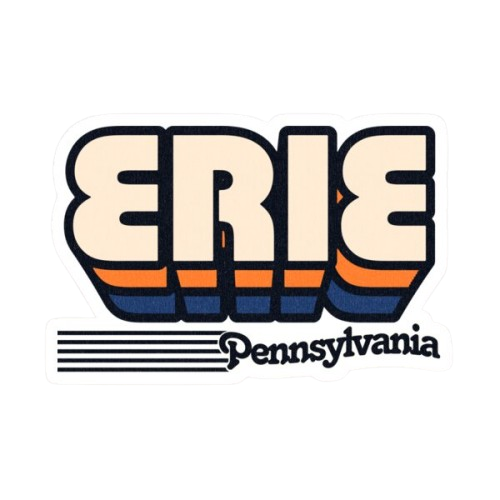

# LivesInErie — a blazing fast website developed with TS + Tailwindcss

[](./LICENSE)


[](https://github.com/YOUR_GITHUB_USERNAME/YOUR_REPO_NAME/actions)
[](https://YOUR_DOCS_URL)




**LivesInErie** is a modern frontend web app built to support and showcase life in the City of Erie.

The goal of this project is to bring together useful information in one place, including:
- Local events and activities  
- Student life and education resources  
- Housing options  
- Job opportunities  
- Community highlights  

The app is designed to be fast, simple, and easy to contribute to.

## Install
make sure you have nodejs in your computers

```bash
git clone https://github.com/6namdang/LivesInErie.git
```

# UPDATES
## JAN 26
- **Finishing on the landing page, setting up all lintings and CI/CD pipelines for deployment and testing

# In Progress
## Jan 28
- [x] Landing page
- [x] Linting setup
- [x] CI/CD pipelines
- [ ] Expanding site content
- [ ] Improving accessibility
- [ ] Performance optimizations
- [ ] Mobile responsiveness

## Tech Stack

- Vite
- React
- TypeScript
- Tailwind CSS
- ESLint
- Prettier
- pnpm or npm

